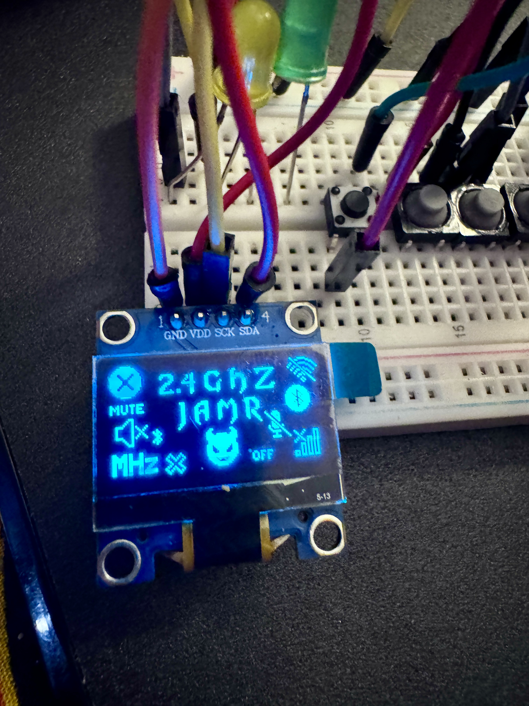
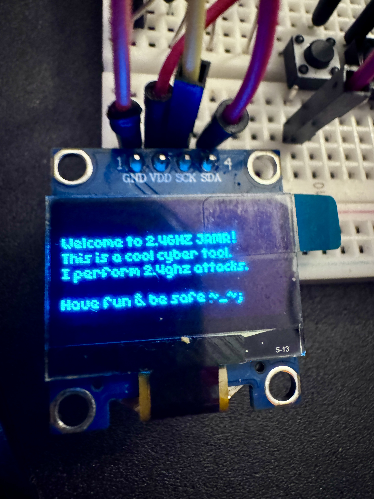
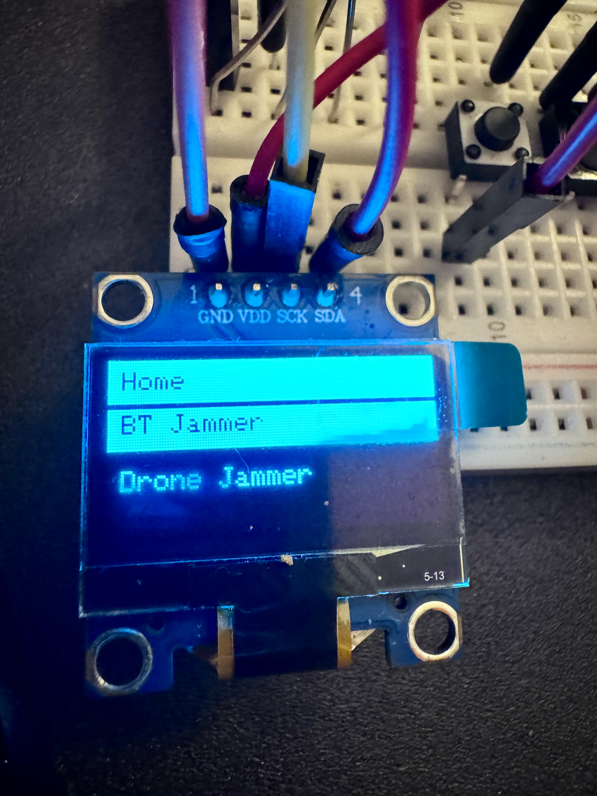
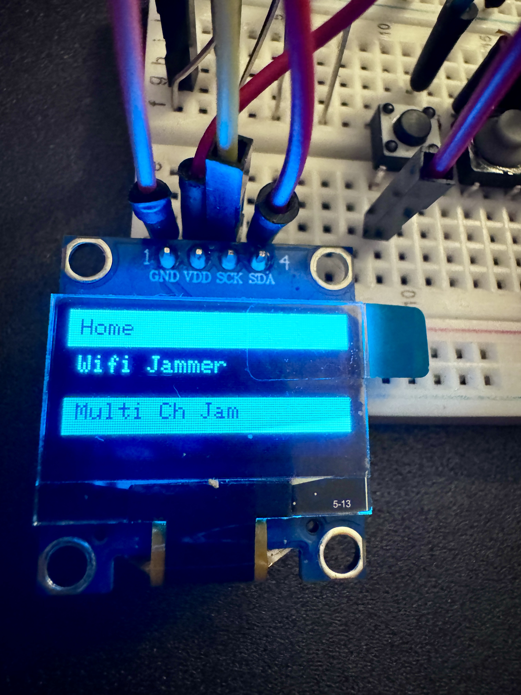
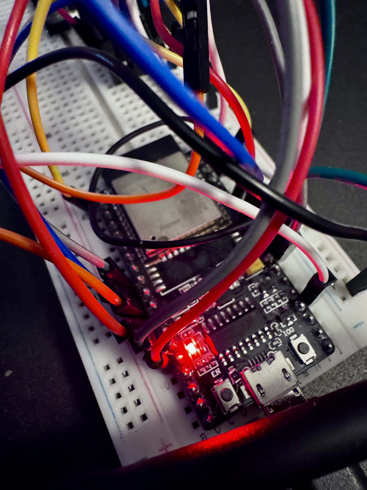
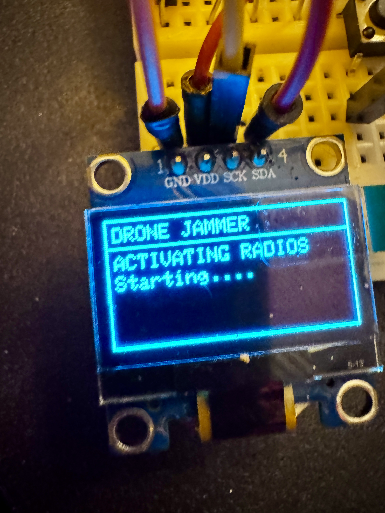
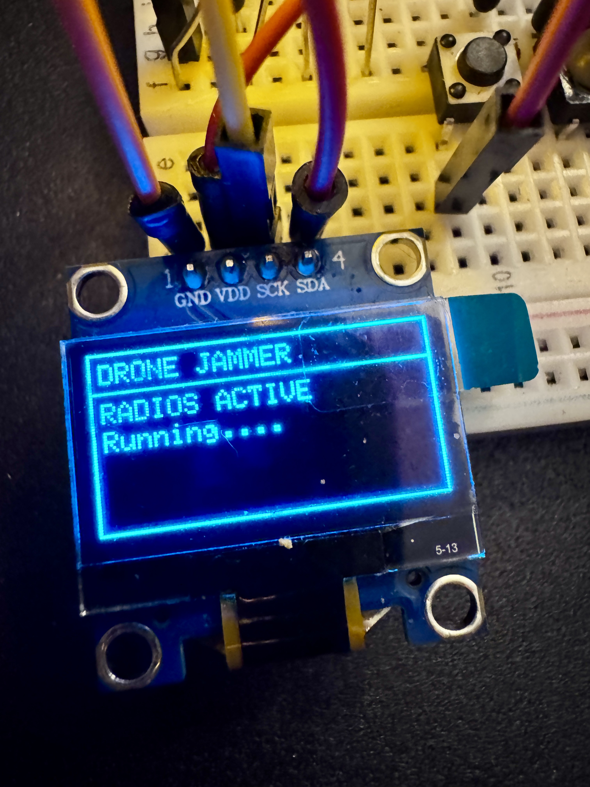

# Cypher Jammer DELUXE
2NRF's, Oled screen, 3 buttons, and LED (optional)

### Open-source Wireless Jamming Pentesting Device using ESP32-WROOM-32D & 2 NRFL01+PA+LNA Modules

This is an ESP32 wireless pentesting device that generates 2.4GHz signals at various channels. This is an upgrade to the previous cypher-jammer, and adds an SSD1306 display and buttons & optional led. This allows much more flexiblility when using the device.

** PCB COMING SOON **








 
 **WARNING!!! JAMMING IS ILLEGAL**
 ---
# WHAT DOES IT DO?

**IT CREATES NOISE SIGNAL TO JAM BLUETOOTH, DRONES, AND WIFI USING NRF24L01 AND ESP32 IN RANGE 2.4GHZ DEVICES , EFFECTS MAY VARY DEPENDS ON DEVICE BLUETOOTH VERSIONS **

---

---
## REQUIRED DEVICE AND MODULE:
1. `2pc  NRF24LO1+PA+LNA`
- https://amzn.to/41cax0I

2. `1pc ESP32`
- https://amzn.to/40UCOaV


3. `10UF-100UF CAPACITOR ` 
- https://amzn.to/4aUpl7v

4. `SSD1306 128x64 .96in Display ` 
- https://amzn.to/3QeGX4M
5. `3 Tactile Buttons `
  

---

 ## PINS TO ATTACH NRF24L01 TO ESP32

### FOR 3 NRF24s
+ Radio 1 ` VSPI= SCK = 14, MISO =13, MOSI = 12 ,CS =21 ,CE = 15`
+ Radio 2 ` VSPI= SCK = 18, MISO =19, MOSI = 23 ,CS =25 ,CE = 26`
+ use 3.3v

+ buttons ` Up = 22, Down = 32, Select = 33`(one side of button connecting to gnd, other to pin)
+ oled screen pin ` sda = 5, scl = 4`

+ https://github.com/T-vK/ESP32-BLE-Keyboard
 you need this libary as its not in the Arduino IDE library. 


** edit code here to change radios **
// radio(CE, CS)
RF24 radio(15, 21, 16000000);   // Radio 1
RF24 radio2(26, 25, 16000000);  // Radio 2
(you will only need 7/8 pins connected)


you will also need to downgrade your esp32 board version to 2.06 
In Arduino IDE, go to Tools > Board > Boards Manager.

Search for esp32.

Click the version dropdown and install: 2.06


### LED PIN (OPTIONAL)
- `PIN 27 OF YOUR ESP32 `
---
## WIRING DIAGRAM


### NRF24L01 PINS
- 

### HOW YOU ATTACH CAPACITOR LOOK OUT FOR POLAROITY SIGNS `- +`
- 

## SOME NOTES

* NRF24 CAN DO 125 CHANNELS & YOU CAN EDIT IT IN CODE
- BLUETOOTH CLASSIC 80 CHANNELS
+ BLE USES 40 CHANNELS
* WIFI USES 1-14 CHANNELS
* DRONE 2.4GHZ 1-125 SO YOU NEED TO EDIT CODE TO HOPE 125 CHANNELS
```
	
